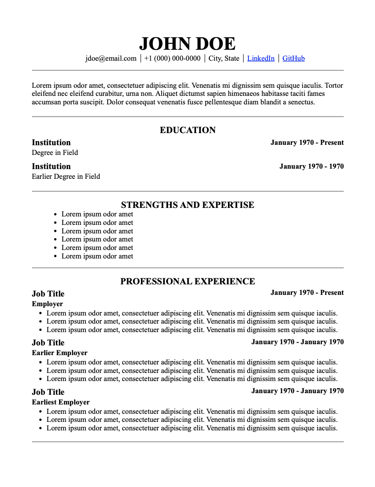
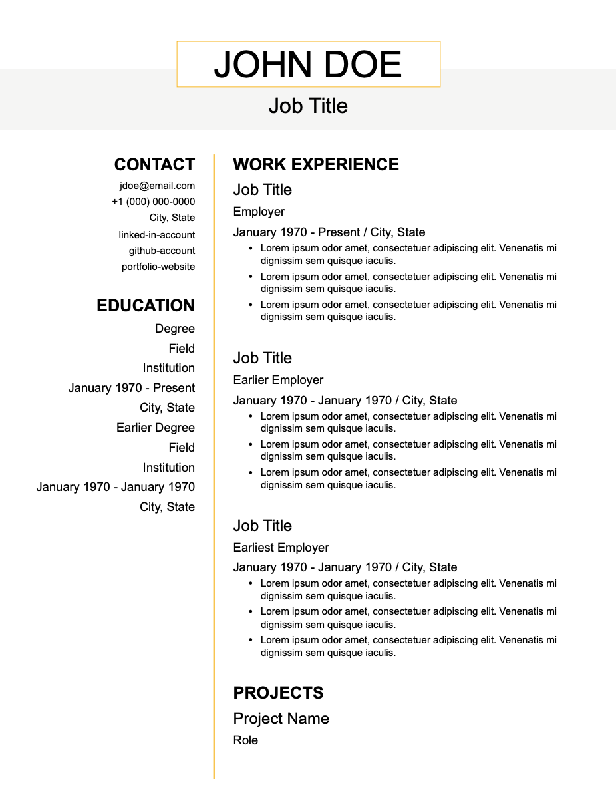

# Resume Generator

> A Tool for Generating Re-usable Resumes with Customizable Templates

## Getting Started

Clone the repository

```sh
git clone git@github.com:ian-shakespeare/resume-generator.git
```

Build the CLI

```sh
make cli
```

Add the executable to path

```sh
export PATH="$PATH:/path/to/exe/dir/"
```

## Usage

### To get help with command-line arguments

```sh
resumegen --help
```

### Using command-line arguments

```sh
# From YAML
resumegen resumedata.yml -o outputdirectory/

# From JSON
resumegen resumedata.json -o outputdirectory/

# With template
resumegen resumedata.yml -o outputdirectory/ -t templatename

# As HTML
resumegen resumedata.yml -o outputdirectory/ -f html

# With example data
resumegen -e -o outputdirectory/
```

## Available Templates

### `default`



### `art-deco`


